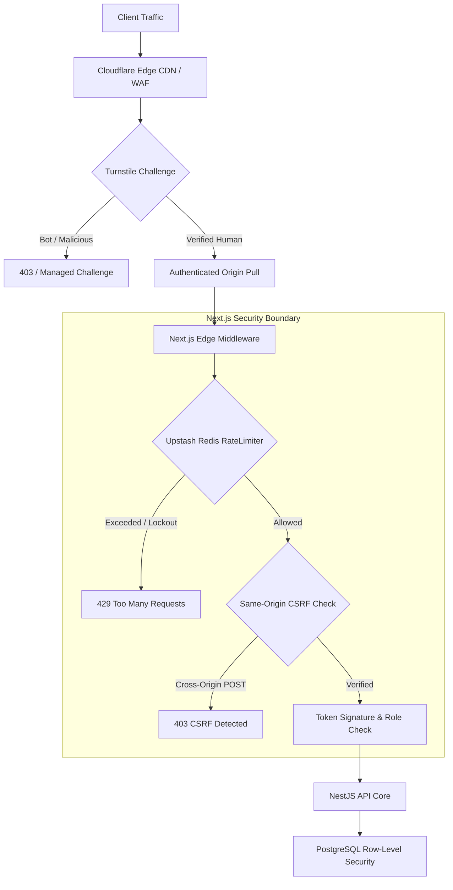
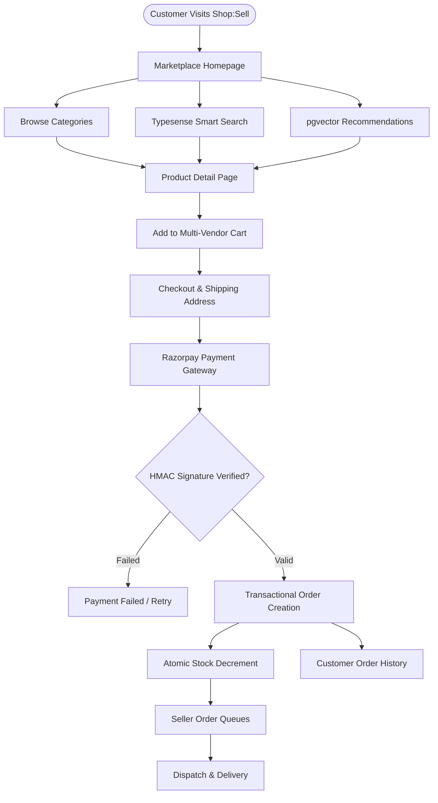
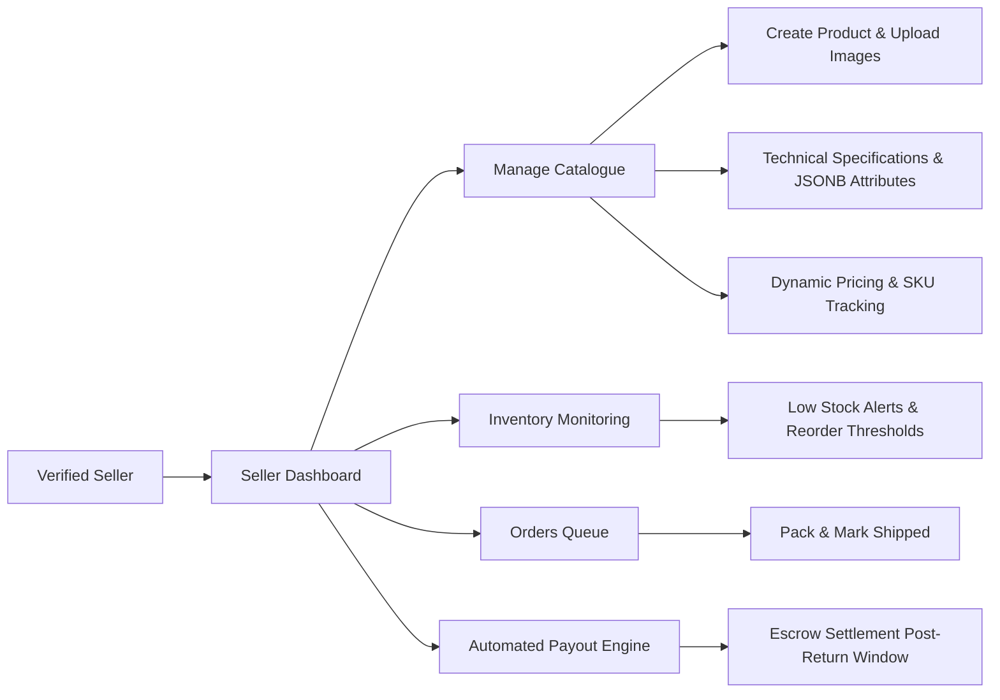
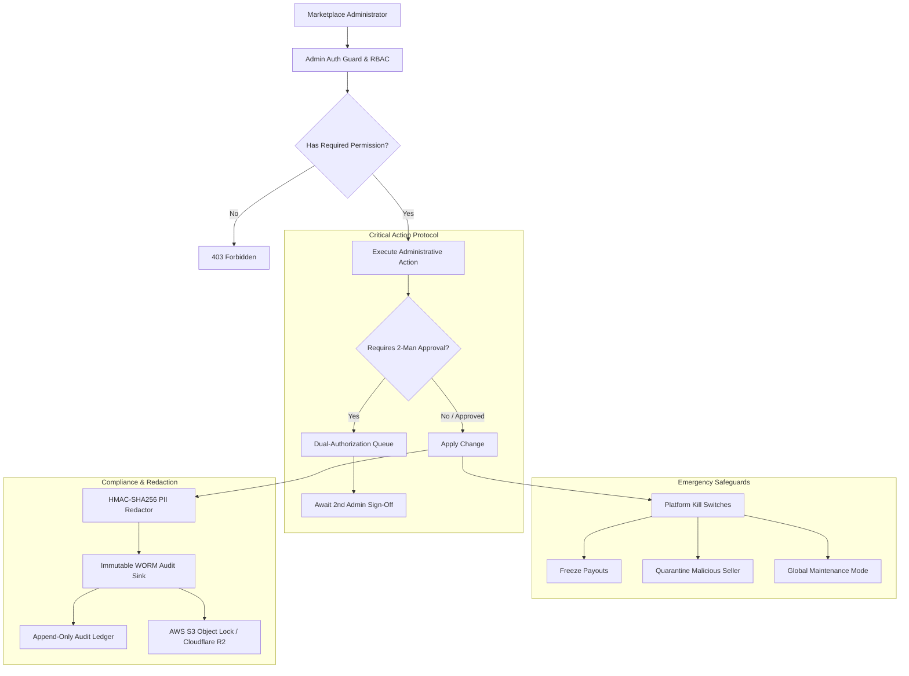
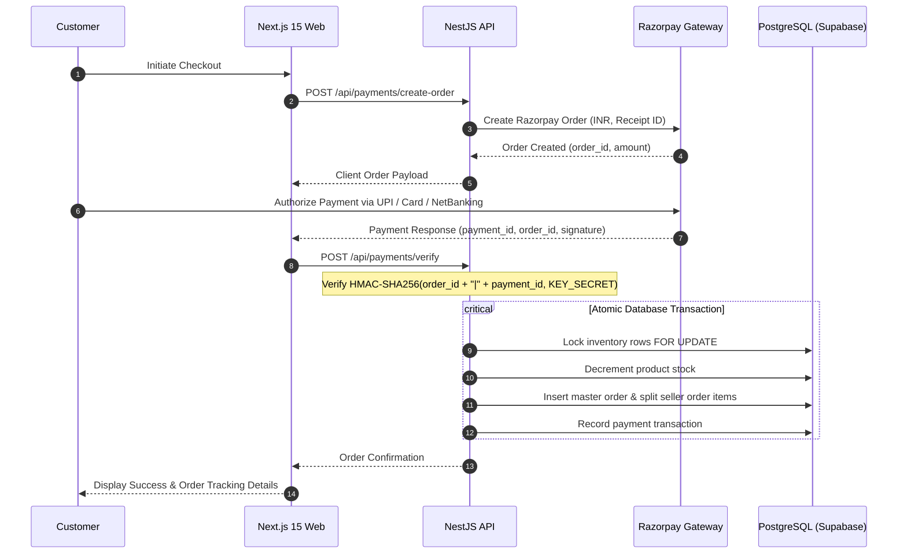
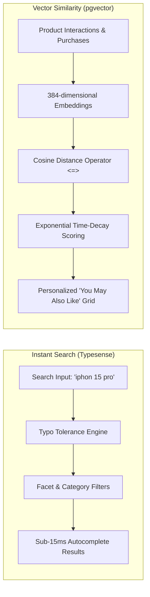

# Shop:Sell

<div align="center">

# 🛍️ Shop:Sell
### Enterprise-Grade Multi-Vendor E-Commerce & Marketplace Platform

**Discover. Shop. Sell. Govern.**

A full-stack, cloud-native multi-vendor marketplace connecting customers, sellers, and administrators through a unified, high-performance shopping engine.

---

[](file:///Users/jathinreddy/Desktop/Shop:Sell#-interactive-testing-suite)
[-blueviolet?style=for-the-badge&logo=shield)](file:///Users/jathinreddy/Desktop/Shop:Sell#-cloudflare-security-turnstile--origin-protection)
[](https://nextjs.org/)
[](https://react.dev/)
[](https://www.typescriptlang.org/)
[](https://nestjs.com/)
[](https://supabase.com/)
[](https://github.com/pgvector/pgvector)
[](https://typesense.org/)
[](https://upstash.com/)
[](https://razorpay.com/)
[](https://www.cloudflare.com/)

<br />

#### ⚡ Quick Jump Navigation

[**🚀 Quick Start**](#-quick-start) • [**🛡️ Edge Security**](#-cloudflare-security-turnstile--origin-protection) • [**📐 Architecture Drawers**](#-interactive-architecture-drawers) • [**🛒 Experiences**](#-interactive-experience-tours) • [**🧪 Tests**](#-interactive-testing-suite) • [**📚 Docs Hub**](#-documentation-hub)

</div>

---

## 🚀 Quick Start

Follow this interactive 4-step checklist to run Shop:Sell locally in under 3 minutes:

<details open>
<summary><b>1. Clone & Install Dependencies</b></summary>

```bash
# Clone the repository
git clone https://github.com/jathinreddy-5/Shop-Sell.git
cd Shop-Sell

# Install dependencies across all monorepo workspaces (apps/web, apps/api, packages/shared)
npm install
```
</details>

<details open>
<summary><b>2. Configure Environment Variables</b></summary>

```bash
# Copy the environment template
cp .env.example .env
```

<details>
<summary><b>🔍 View Key Environment Variables Matrix (Click to expand)</b></summary>

| Variable | Default (Dev) | Description |
|---|---|---|
| `NODE_ENV` | `development` | Set to `production` in live deployments |
| `JWT_SECRET` | `dev-jwt-secret-min-32-chars-long!` | Shared symmetric key for HS256 JWT signing & verification |
| `SUPABASE_JWT_SECRET` | `dev-jwt-secret-min-32-chars-long!` | Supabase token signature secret (must match JWT_SECRET in dev) |
| `INTERNAL_API_SECRET` | `dev-internal-api-secret-min-32-chars!` | Shared secret for trusted web-to-API proxy endpoints |
| `LOG_HASH_KEY` | `dev-log-hash-key-min-32-chars-long!` | HMAC-SHA256 salt for GDPR-compliant PII log redaction |
| `ENABLE_DEMO_ACCOUNTS` | `false` | Development flag for local testing accounts |
| `UPSTASH_REDIS_REST_URL` | *(Optional in dev)* | Upstash Redis URL for distributed rate limiting & token blacklist |
| `UPSTASH_REDIS_REST_TOKEN` | *(Optional in dev)* | Upstash REST authentication token |
| `CLOUDFLARE_TURNSTILE_SECRET_KEY` | *(Optional in dev)* | Cloudflare Turnstile CAPTCHA secret |
| `NEXT_PUBLIC_TURNSTILE_SITE_KEY` | *(Optional in dev)* | Public site key rendered in client-side auth forms |

</details>
</details>

<details open>
<summary><b>3. Seed Database & Synchronize Search Engine</b></summary>

```bash
# Seed PostgreSQL tables, sample sellers, categories, and pgvector embeddings
npm run seed

# Synchronize product catalogue into Typesense search engine
npm run reindex
```
</details>

<details open>
<summary><b>4. Launch Development Servers</b></summary>

```bash
# Start frontend (Next.js 15) and backend (NestJS) concurrently
npm run dev
```

- 🌐 **Web Front**: [http://localhost:3000](http://localhost:3000)
- 🔌 **API Engine**: [http://localhost:4000](http://localhost:4000)

</details>

<p align="right"><a href="#shopsell">⬆ Back to Top</a></p>

---

## 🛡️ Cloudflare Security, Turnstile & Origin Protection

Shop:Sell is engineered with defense-in-depth edge protection to prevent credential stuffing, bot scraping, and unauthorized origin traffic:



<details>
<summary><b>🔒 Interactive Edge Security Breakdown (Click to expand)</b></summary>

- **Cloudflare Turnstile**: Managed challenge protection on login (`/login`), OTP generation (`/api/auth/request-otp`), and seller applications (`/become-a-seller`).
- **Cryptographic Token Verification**: Edge middleware verifies short-lived (15 min) JWT access tokens via `jose` (HS256) using `JWT_SECRET`. Client-submitted `shopsell_roles` cookies are never trusted for authorization.
- **Shared-Store Rate Limiting**: Per-email and per-IP login throttling, 5 OTPs/hour limit, and lockout after 5 failed verification attempts via Upstash Redis.
- **Origin Protection & Authenticated Origin Pulls**: Ensure origin web traffic is strictly restricted to official Cloudflare IP ranges and verified via client TLS certificates.
- **Detailed Checklist**: Refer to [`docs/cloudflare-setup.md`](docs/cloudflare-setup.md) for step-by-step dashboard instructions.

</details>

<p align="right"><a href="#shopsell">⬆ Back to Top</a></p>

---

## 📐 Interactive Architecture Drawers

Explore the architecture and system flows through interactive collapsible diagrams:

<details>
<summary><b>1. 🛒 Customer Discovery & Shopping Lifecycle (Click to expand)</b></summary>



</details>

<details>
<summary><b>2. 🏪 Seller Store, Inventory & Payout Lifecycle (Click to expand)</b></summary>



</details>

<details>
<summary><b>3. 🛡️ Admin Governance, Kill Switches & WORM Audit Trail (Click to expand)</b></summary>



</details>

<details>
<summary><b>4. 💳 Transactional Order & Razorpay Payment State Machine (Click to expand)</b></summary>



</details>

<details>
<summary><b>5. 🧠 pgvector & Typesense Search / Recommendation Pipeline (Click to expand)</b></summary>



</details>

<p align="right"><a href="#shopsell">⬆ Back to Top</a></p>

---

## 🛒 Interactive Experience Tours

<details>
<summary><b>🛍️ Customer Experience Showcase (Click to expand)</b></summary>

- **Instant Autocomplete & Typo Tolerance**: Fast search matching across names, descriptions, categories, and sellers.
- **Dynamic Category Explorers**: Filter by price brackets, tags, ratings, and instant availability.
- **Interactive Product Dossier**: Tabbed specifications, detailed dimensions, high-resolution imagery, and verified seller trust cards.
- **Multi-Vendor Shared Cart**: Buy items from multiple independent sellers in a single checkout session.
- **Progressive Onboarding**: Seamless post-login profiling for address management and shipping preferences.

</details>

<details>
<summary><b>🏪 Seller Experience Showcase (Click to expand)</b></summary>

- **Merchant Portal**: Dedicated dashboard tracking revenue, order fulfillment status, low-stock warnings, and metrics.
- **Product & Inventory Engine**: Complete CRUD over listings, multi-image upload support, category tagging, and JSONB custom specifications.
- **Automated Payout Engine**: Transparent ledger detailing gross sales, marketplace commission deductions, and net pending payouts.
- **Order Dispatch Workflow**: One-click status updates from `PENDING` → `CONFIRMED` → `SHIPPED` → `DELIVERED`.

</details>

<details>
<summary><b>🛡️ Administrator Experience Showcase (Click to expand)</b></summary>

- **Enterprise RBAC**: Fine-grained permissions (`USERS_READ`, `SELLERS_APPROVE`, `FINANCE_PAYOUT`, `SYSTEM_CONFIG`).
- **Emergency Kill Switches**: Instant platform-wide kill switches to freeze payouts, disable new user registrations, or halt order placements.
- **Two-Man Rule Dual Approvals**: High-risk operations (e.g. manual balance adjustments, seller bans) require sign-off by a secondary admin.
- **WORM Audit Trail**: Write-Once-Read-Many tamper-proof logging with cryptographic SHA-256 chain verification.

</details>

<p align="right"><a href="#shopsell">⬆ Back to Top</a></p>

---

## 🧪 Interactive Testing Suite

The repository contains **138 automated unit, integration, and security tests** across all monorepo workspaces:

```text
┌───────────────────────────────────────────────────────────┐
│              MONOREPO TEST SUITE SUMMARY                  │
├──────────────────────────────┬──────────────┬─────────────┤
│ Workspace                    │ Test Count   │ Status      │
├──────────────────────────────┼──────────────┼─────────────┤
│ apps/web (Next.js 15)        │ 32 Tests     │ ✅ PASSING  │
│ apps/api (NestJS)            │ 95 Tests     │ ✅ PASSING  │
│ packages/shared (Types/RLS)  │ 11 Tests     │ ✅ PASSING  │
├──────────────────────────────┼──────────────┼─────────────┤
│ Total Monorepo Test Coverage │ 138 Tests    │ ✅ ALL PASS │
└──────────────────────────────┴──────────────┴─────────────┘
```

<details open>
<summary><b>👉 Click to run and inspect test commands</b></summary>

```bash
# Run all tests across the entire monorepo
npm run test

# Run Next.js security hardening and auth tests
npm --prefix apps/web test

# Run NestJS API and Admin Governance tests
npm --prefix apps/api test

# Run Shared Package & Database Migration tests
npm --prefix packages/shared test

# Run k6 load testing against local API
k6 run test/k6/load-test.js
```

</details>

<p align="right"><a href="#shopsell">⬆ Back to Top</a></p>

---

## 🧩 Interactive Feature Matrix

| Feature | Scope | Status | Technology |
|---|---|---|---|
| **Multi-Vendor Storefront** | Customer | `✅ Production` | Next.js 15, React 18, Tailwind CSS |
| **Passwordless Email Auth** | Security | `✅ Production` | OTP Verification, TimingSafeEqual, Redis Lockout |
| **Typo-Tolerant Search** | Core | `✅ Production` | Typesense, Prefixes, Faceted Filtering |
| **Vector Similarity Engine** | Core | `✅ Production` | PostgreSQL, pgvector (384-dim), Time-Decay |
| **Multi-Seller Cart & Orders** | Customer | `✅ Production` | Atomic DB Transactions, Inventory Mutex |
| **Razorpay Checkout** | Payments | `✅ Production` | Server-Side HMAC-SHA256 Signature Verification |
| **Seller Portal & Analytics** | Seller | `✅ Production` | Next.js Dashboard, Stock Tracking, Payout Ledger |
| **Admin RBAC & Governance** | Admin | `✅ Production` | NestJS Guards, Elevation Tokens, Dual-Approvals |
| **WORM Compliance Logging** | Admin | `✅ Production` | Immutable S3 / Local Object Lock Sink |
| **Cloudflare Edge Defense** | Security | `✅ Production` | Turnstile, Authenticated Origin Pulls, Upstash Rate Limiter |

<p align="right"><a href="#shopsell">⬆ Back to Top</a></p>

---

## 📚 Documentation Hub

Explore in-depth design specifications and implementation guides:

| Document | Purpose |
|---|---|
| [`docs/cloudflare-setup.md`](docs/cloudflare-setup.md) | Step-by-step Cloudflare Turnstile, WAF rules & Authenticated Origin Pulls guide |
| [`docs/security-fixes.md`](docs/security-fixes.md) | Exhaustive documentation of all Phase 1 & 2 security hardening implementations |
| [`docs/admin-management-and-governance.md`](docs/admin-management-and-governance.md) | Full architectural specification for Admin RBAC, elevation & kill-switches |
| [`docs/architecture.md`](docs/architecture.md) | Scaling topology: PgBouncer, Read Replicas, Redis Clusters & CDN Caching |
| [`docs/user-onboarding-specification.md`](docs/user-onboarding-specification.md) | Progressive profiling flow and onboarding modal specification |
| [`docs/admin/permissions.md`](docs/admin/permissions.md) | Comprehensive admin roles and permission code matrix |
| [`docs/admin/audit.md`](docs/admin/audit.md) | Cryptographic audit trail, redaction format, and sink interfaces |

---

<div align="center">

**Built with pride for high-scale multi-vendor commerce.**  
*Shop:Sell — Discover. Shop. Sell. Govern.*

[⬆ Back to Top](#shopsell)

</div>
