# Shop:Sell

### A Scalable Multi-Vendor Marketplace

<p align="center">
  <strong>Discover. Shop. Sell. Manage.</strong>
</p>

<p align="center">
  A full-stack multi-vendor marketplace connecting customers, sellers, and administrators through a unified shopping platform.
</p>

<p align="center">


</p>

---

## Table of Contents

- [Overview](#overview)
- [Technology Stack](#technology-stack)
- [How Shop:Sell Works](#how-shopsell-works)
- [Customer Experience](#customer-experience)
- [Seller Experience](#seller-experience)
- [Admin Experience](#admin-experience)
- [Smart Search](#smart-search)
- [Personalized Recommendations](#personalized-recommendations)
- [Cart and Checkout](#cart-and-checkout)
- [Order and Inventory Flow](#order-and-inventory-flow)
- [System Architecture](#system-architecture)
- [Role Architecture](#role-architecture)
- [Project Structure](#project-structure)
- [Getting Started](#getting-started)
- [Testing](#testing)
- [Deployment](#deployment)
- [Scalability](#scalability)
- [Project Vision](#project-vision)

---

# Overview

**Shop:Sell** is a multi-vendor e-commerce marketplace where multiple independent sellers can list and sell their products while customers can discover, purchase, and manage orders from a single platform.

The platform is designed around three major experiences:

```mermaid
mindmap
  root((Shop:Sell))
    Customer
      Discover Products
      Search
      Recommendations
      Cart
      Checkout
      Payments
      Orders
    Seller
      Store
      Products
      Inventory
      Orders
      Sales
      Payouts
    Admin
      Sellers
      Products
      Categories
      Disputes
      Analytics
      Moderation
```

### The Marketplace in One View

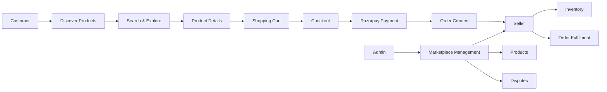

---

# Technology Stack

Shop:Sell uses a cloud-native architecture designed to keep the frontend, backend, database, search, payments, storage, and background processing independently scalable.

## Technology Map

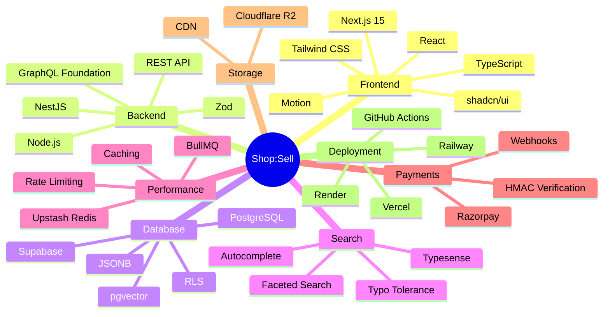

## Stack Breakdown

| Layer | Technology | Purpose |
|---|---|---|
| Frontend | Next.js 15 | Marketplace web application |
| UI | React + TypeScript | Interactive and type-safe UI |
| Styling | Tailwind CSS | Responsive styling |
| Components | shadcn/ui | Reusable UI system |
| Animation | Motion | UI transitions and interactions |
| Backend | NestJS | Modular API |
| Runtime | Node.js | Backend execution |
| Database | PostgreSQL | Core marketplace data |
| Database Platform | Supabase | Hosted PostgreSQL and authentication |
| Vector Search | pgvector | Product similarity |
| Search | Typesense | Fast product search |
| Cache | Upstash Redis | Caching and rate limiting |
| Queue | BullMQ | Background jobs |
| Payments | Razorpay | Online payments |
| Storage | Cloudflare R2 | Product media |
| Frontend Hosting | Vercel | Web deployment |
| API Hosting | Railway / Render | Backend deployment |
| CI | GitHub Actions | Automated checks |

> **Docker is not required** for the application architecture.

---

# How Shop:Sell Works

The marketplace connects the complete shopping lifecycle.

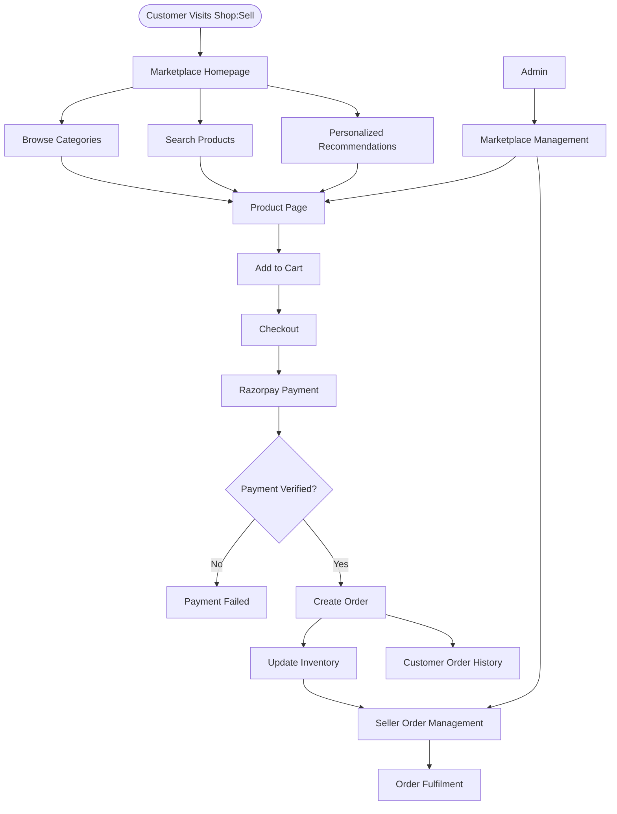

---

# Customer Experience

The customer side of Shop:Sell is focused on product discovery, shopping, payment, and order management.

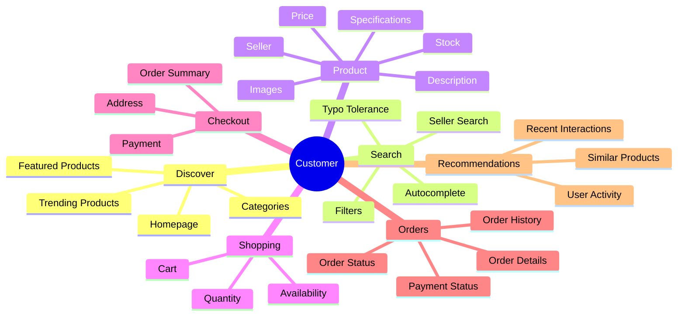

## Homepage

The homepage acts as the main product discovery interface.

Customers can explore:

- Featured products
- Trending products
- Recommended products
- Popular categories
- Products from different sellers
- Recently viewed products

---

## Product Discovery

Customers can discover products through multiple paths:

```text
                 Product Discovery
                        |
        +---------------+---------------+
        |               |               |
        v               v               v
    Categories        Search       Recommendations
        |               |               |
        +---------------+---------------+
                        |
                        v
                 Product Details
```

---

# Smart Search

Shop:Sell uses **Typesense** to provide fast and typo-tolerant product discovery.

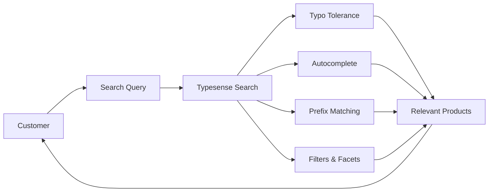

### Example

```text
Customer enters:

"iphon 15 pro"

        ↓

Search understands the query

        ↓

iPhone 15 Pro
iPhone 15 Pro Max
iPhone 15
...
```

Search supports:

- Autocomplete
- Typo tolerance
- Prefix matching
- Category filters
- Seller filters
- Product filters
- Faceted search

---

# Personalized Recommendations

Shop:Sell includes a product recommendation system designed to improve product discovery.

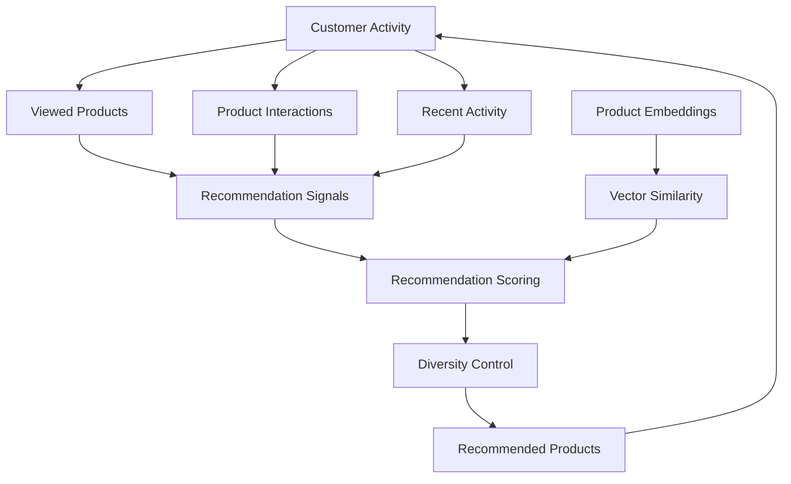

The recommendation system can consider:

- Previous product interactions
- Recently viewed products
- Product similarity
- Product embeddings
- Recency of activity

The architecture uses **pgvector** for vector-based product similarity.

A time-decay component can also reduce the influence of older interactions.

---

# Seller Experience

Sellers operate their own stores within the marketplace.

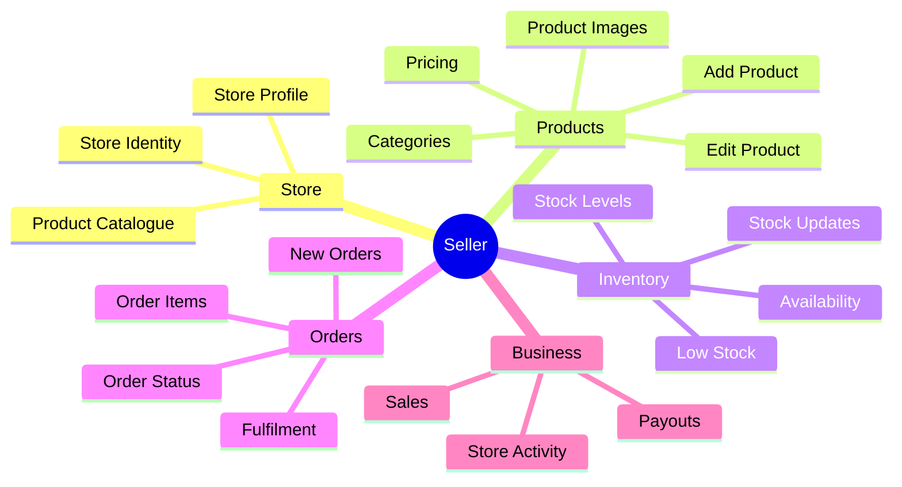

---

# Seller Dashboard

The seller dashboard provides a centralized view of store activity.

Example:

```text
+------------------------------------------------+
|              SELLER DASHBOARD                  |
+------------------------------------------------+
|                                                |
|   Products       Orders        Sales           |
|      128           342        ₹2,45,000        |
|                                                |
+------------------------------------------------+
|                                                |
|   Low Stock Products: 7                        |
|   Pending Orders: 18                           |
|                                                |
+------------------------------------------------+
```

Seller functionality includes:

- Product management
- Inventory management
- Order management
- Store management
- Sales information
- Payout calculations
- Low-stock monitoring

---

# Product Management

Sellers can manage their own product catalogue.

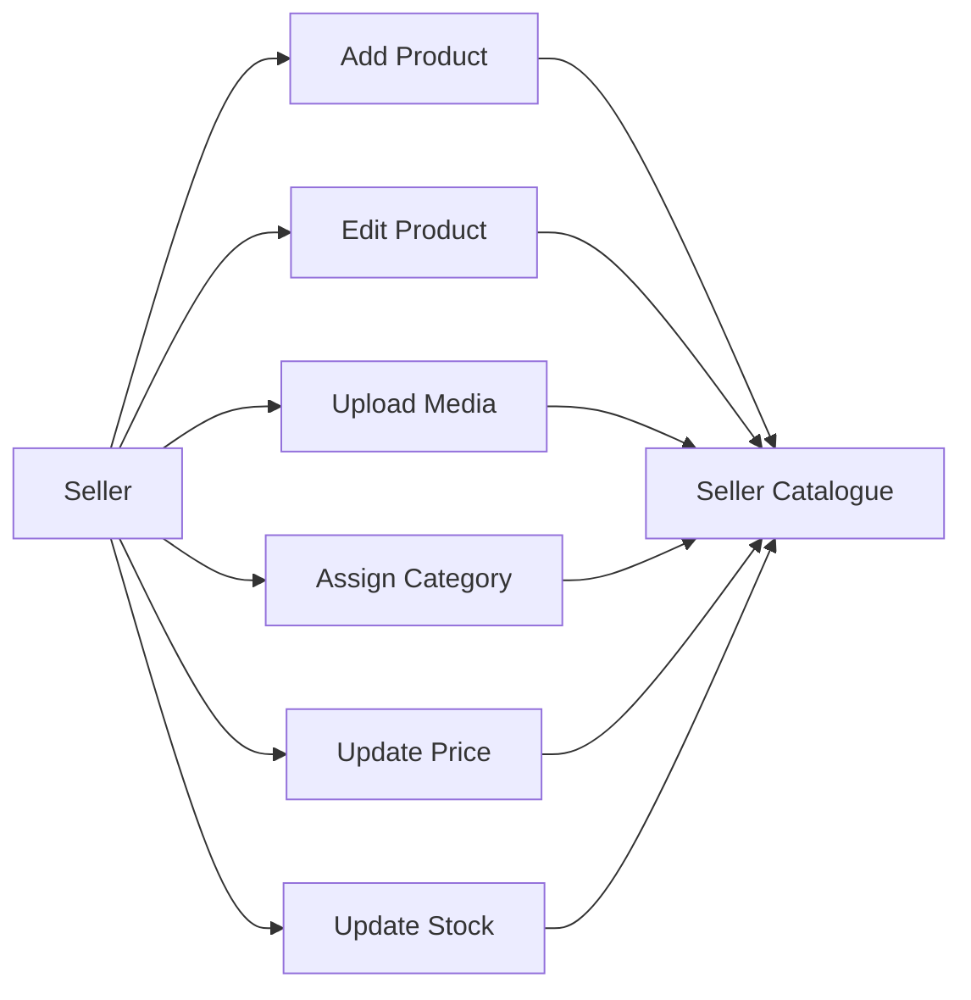

---

# Inventory Management

Inventory consistency is important in a multi-vendor marketplace.

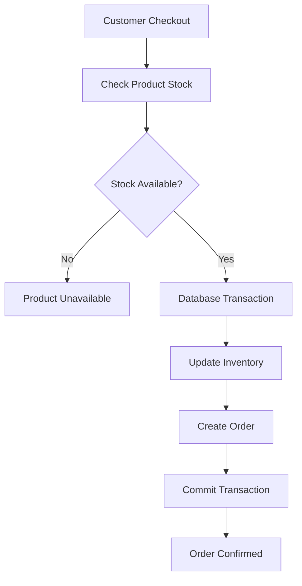

The transactional approach helps reduce overselling during concurrent purchases.

---

# Cart and Checkout

The customer purchase flow is:

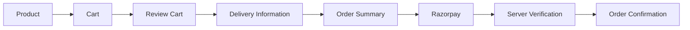

The cart can contain products from multiple sellers.

Customers can:

- Add products
- Remove products
- Change quantities
- Review prices
- Check availability
- View seller information
- Proceed to checkout

---

# Payment Architecture

Payments are processed through Razorpay.

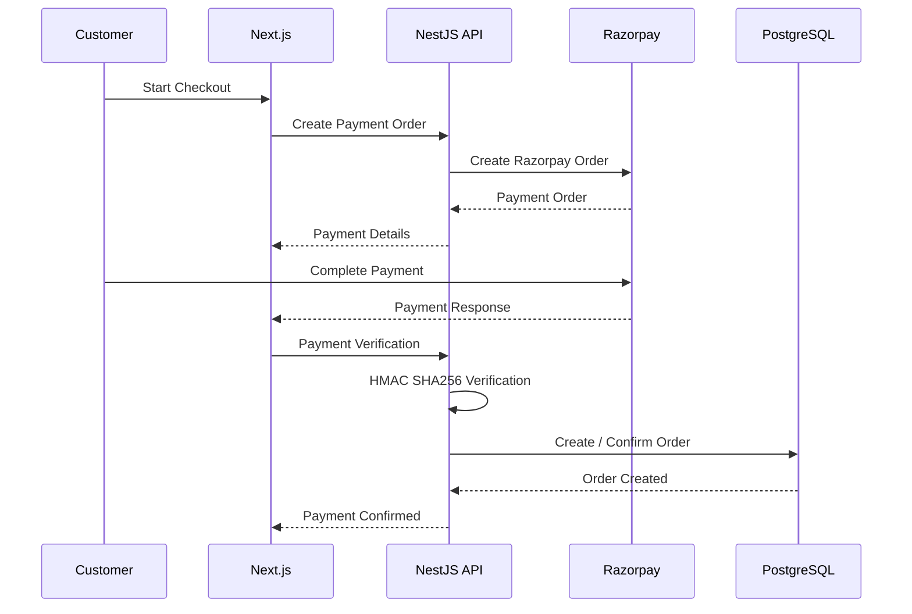

Payment security includes:

- Server-side payment verification
- HMAC SHA256 signature verification
- Razorpay webhook processing
- Server-side secret management

---

# Order and Inventory Flow

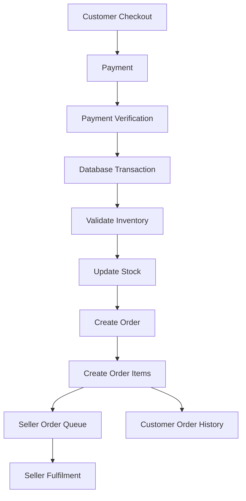

This ensures that payment, order creation, and inventory operations are handled as a coordinated workflow.

---

# Admin Experience

Administrators manage the overall marketplace.

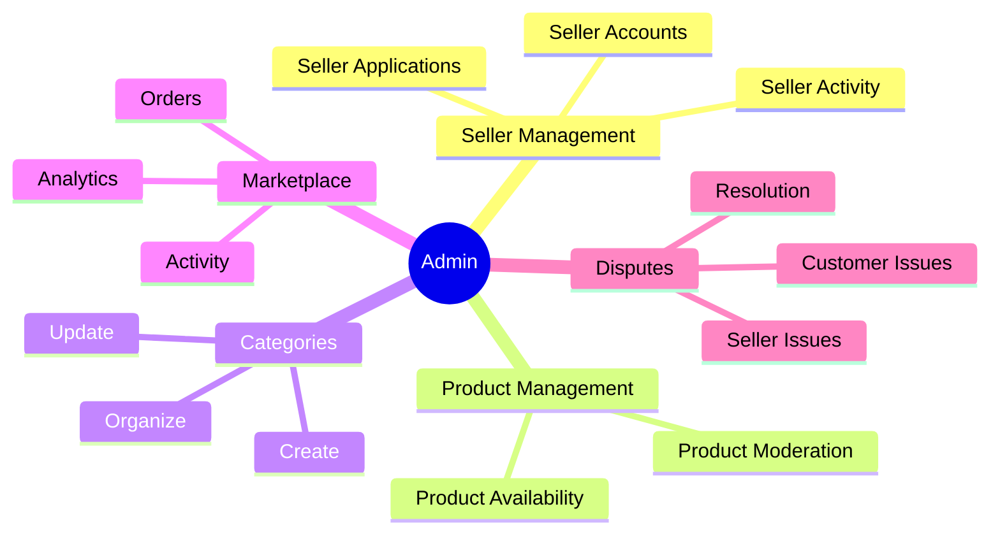

Admin capabilities include:

- Seller management
- Product moderation
- Category management
- Marketplace analytics
- Dispute management
- Platform-level controls

---

# Role Architecture

Shop:Sell uses role-based access control.

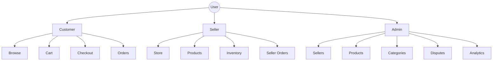

Authorization is enforced through backend guards and database security policies.

---

# System Architecture

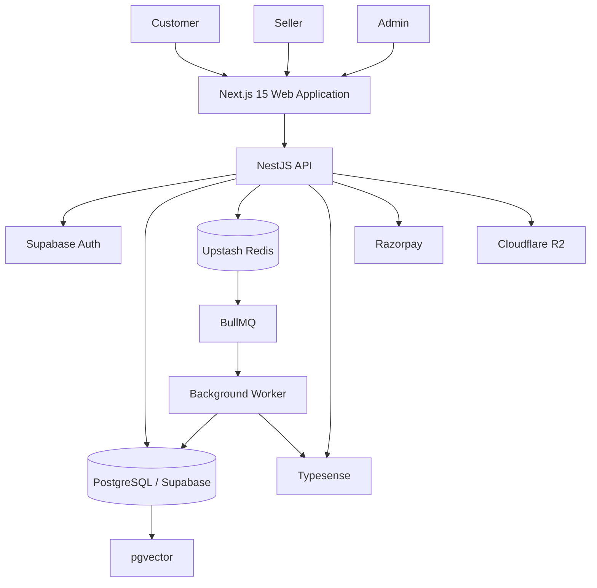

---

# Infrastructure Architecture

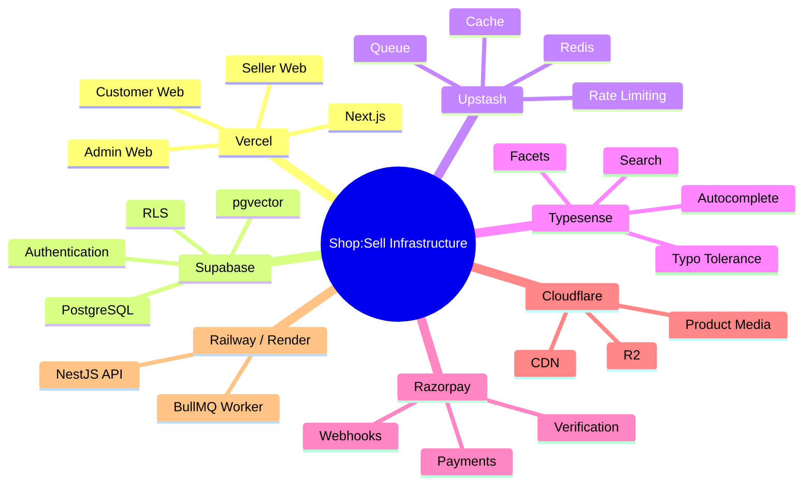

---

# Background Processing

Shop:Sell uses **Redis + BullMQ** for asynchronous processing.

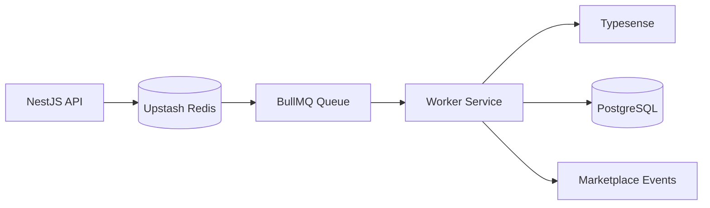

This allows operations that do not need to block the customer-facing request to run asynchronously.

---

# Security

Shop:Sell includes multiple security layers.

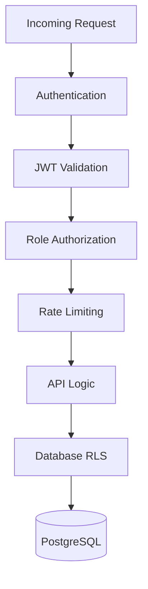

Security mechanisms include:

- Supabase authentication
- JWT validation
- Role-based authorization
- Row Level Security
- API rate limiting
- Server-side payment verification
- Razorpay webhook verification
- Environment-based secret management
- Transactional database operations
- Seller data isolation

---

# Project Structure

```text
Shop:Sell/
│
├── apps/
│   │
│   ├── web/
│   │   ├── src/
│   │   │   ├── app/
│   │   │   │   ├── (customer)/
│   │   │   │   ├── (seller)/
│   │   │   │   └── admin/
│   │   │   │
│   │   │   └── middleware.ts
│   │   │
│   │   └── package.json
│   │
│   └── api/
│       ├── src/
│       │   ├── common/
│       │   ├── database/
│       │   ├── modules/
│       │   │   ├── auth/
│       │   │   ├── products/
│       │   │   ├── sellers/
│       │   │   ├── search/
│       │   │   ├── cart/
│       │   │   ├── orders/
│       │   │   ├── payments/
│       │   │   ├── events/
│       │   │   ├── recommendations/
│       │   │   ├── admin/
│       │   │   └── payouts/
│       │   │
│       │   └── worker.ts
│       │
│       └── package.json
│
├── packages/
│   └── shared/
│
├── scripts/
│   ├── seed.ts
│   └── reindex.ts
│
├── supabase/
│   ├── migrations/
│   └── seeds/
│
├── test/
│   └── k6/
│       └── load-test.js
│
├── docs/
│   └── architecture.md
│
├── .github/
│   └── workflows/
│       └── ci.yml
│
├── .env.example
├── package.json
└── README.md
```

---

# Getting Started

## Prerequisites

Make sure the following are installed:

- Node.js
- npm
- Git

No Docker installation is required.

---

## Clone the Repository

```bash
git clone https://github.com/jathinreddy-5/Shop-Sell.git

cd Shop-Sell

npm install
```

---

## Environment Configuration

Create your environment file:

```bash
cp .env.example .env
```

Configure the required services:

```text
Supabase
PostgreSQL
Upstash Redis
Typesense
Razorpay
Cloudflare R2
```

Keep all secret keys inside `.env`.

Do not commit `.env` to GitHub.

---

# Database Setup

Shop:Sell uses hosted PostgreSQL through Supabase.

The database includes:

- Marketplace tables
- Product data
- Seller data
- Orders
- Inventory
- Authentication-related data
- Row Level Security
- Database indexes
- pgvector
- Transactional operations

Run the seed process:

```bash
npm run seed
```

The seed process can populate sample marketplace data including:

- Categories
- Sellers
- Stores
- Products
- Product embeddings

---

# Search Index Setup

Synchronize products with Typesense:

```bash
npm run reindex
```

This creates the searchable product catalogue used by the marketplace search interface.

---

# Run the Application

Start the frontend and backend together:

```bash
npm run dev
```

The development environment runs:

```text
Frontend
http://localhost:3000

Backend
http://localhost:4000
```

Run individual services:

```bash
npm run dev:web
```

```bash
npm run dev:api
```

```bash
npm run worker
```

---

# Testing

Run the complete test suite:

```bash
npm run test
```

The test suite covers areas such as:

- Authentication
- Role authorization
- Database migrations
- Product validation
- Search filters
- Order placement
- Inventory management
- Payment verification
- Recommendation scoring
- Seller payouts
- Rate limiting
- Middleware routing

---

# Load Testing

Shop:Sell includes a k6 load-testing configuration.

Run:

```bash
k6 run test/k6/load-test.js
```

The load test covers scenarios such as:

- Homepage requests
- Product discovery
- Search autocomplete
- Product pages
- Checkout requests

---

# Deployment

## Frontend

Deploy the Next.js application using Vercel.

```text
Platform: Vercel
Application: Next.js
Root Directory: apps/web
```

---

## Backend

Deploy the NestJS API using Railway or Render.

```text
Platform: Railway / Render
Application: NestJS
Runtime: Node.js
```

Build:

```bash
npm run build
```

Start:

```bash
npm run start:prod
```

---

## Background Worker

Deploy the BullMQ worker as a separate Node.js service.

```bash
npm run start:worker
```

The worker shares the same:

- Redis
- PostgreSQL
- Typesense

infrastructure as the backend.

---

# Scalability

The architecture is designed so individual components can scale independently.

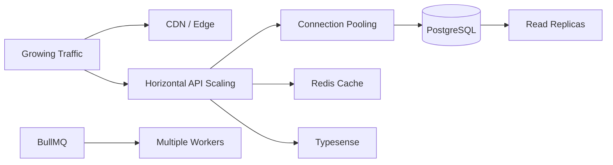

Future scaling strategies can include:

- PostgreSQL connection pooling
- Read replicas
- CDN caching
- Redis caching
- Horizontal API scaling
- Multiple background workers
- Search infrastructure scaling
- Database partitioning
- Catalogue sharding

---

# Key Features

| Feature | Description |
|---|---|
| Multi-Vendor Marketplace | Multiple independent sellers can sell through one platform |
| Customer Marketplace | Browse and purchase products from multiple sellers |
| Smart Search | Typo-tolerant search with autocomplete |
| Personalized Recommendations | Product discovery based on user activity and similarity |
| Product Categories | Structured product discovery |
| Product Pages | Detailed product and seller information |
| Shopping Cart | Manage products before checkout |
| Secure Payments | Razorpay-powered payments |
| Payment Verification | Server-side signature verification |
| Customer Orders | Order history and order details |
| Seller Stores | Individual stores within the marketplace |
| Seller Dashboard | Store-level business overview |
| Product Management | Seller-controlled product catalogue |
| Inventory Management | Stock tracking and low-stock monitoring |
| Transactional Orders | Reliable order and inventory processing |
| Seller Orders | Seller-specific order management |
| Seller Payouts | Seller-specific payout calculations |
| Admin Panel | Marketplace administration |
| Seller Management | Seller application and account management |
| Product Moderation | Marketplace product management |
| Category Management | Marketplace catalogue organization |
| Dispute Management | Marketplace dispute handling |
| Role-Based Access | Customer, seller, and admin permissions |
| Product Media | Cloud-based media storage |
| Background Processing | Asynchronous marketplace operations |
| Rate Limiting | Redis-based API protection |
| Vector Similarity | pgvector-powered product similarity |

---

# Project Vision

Shop:Sell brings the complete marketplace lifecycle into one platform.

```mermaid
flowchart LR
    Discover[Discover] --> Search[Search]
    Search --> Explore[Explore]
    Explore --> Cart[Add to Cart]
    Cart --> Checkout[Checkout]
    Checkout --> Pay[Pay]
    Pay --> Order[Order]
    Order --> Fulfil[Seller Fulfilment]
    Fulfil --> Manage[Marketplace Management]
    Manage --> Discover
```

### The goal

```text
                 SHOP:SELL

        ┌───────────────────────────┐
        │                           │
        │       DISCOVER            │
        │           ↓               │
        │        SEARCH             │
        │           ↓               │
        │        EXPLORE            │
        │           ↓               │
        │       PURCHASE            │
        │           ↓               │
        │         ORDER             │
        │           ↓               │
        │       FULFILMENT          │
        │           ↓               │
        │       MANAGEMENT          │
        │                           │
        └───────────────────────────┘
```

Shop:Sell combines **customer shopping, seller management, marketplace administration, intelligent search, recommendations, secure payments, inventory management, and scalable cloud infrastructure** into a unified multi-vendor marketplace.
