# 🛍️ Shop:Sell
### Multi-Vendor E-Commerce & Marketplace Platform

**Discover. Shop. Sell. Govern.**

Customers, sellers, and administrators on one marketplace engine: Next.js storefront, NestJS API, Supabase Postgres, Typesense search, Razorpay payments, and Cloudflare edge protection.

[](https://github.com/jathinreddy-5/Shop-Sell/actions)
[](https://nextjs.org/)
[](https://react.dev/)
[](https://www.typescriptlang.org/)
[](https://nestjs.com/)
[](https://supabase.com/)
[](https://typesense.org/)
[](https://upstash.com/)
[](https://razorpay.com/)
[](https://www.cloudflare.com/)

</div>

---

## 🧭 Start Here: The Clickable Map

Everything in this README is reachable from the map below. Pick a node, then follow its link.

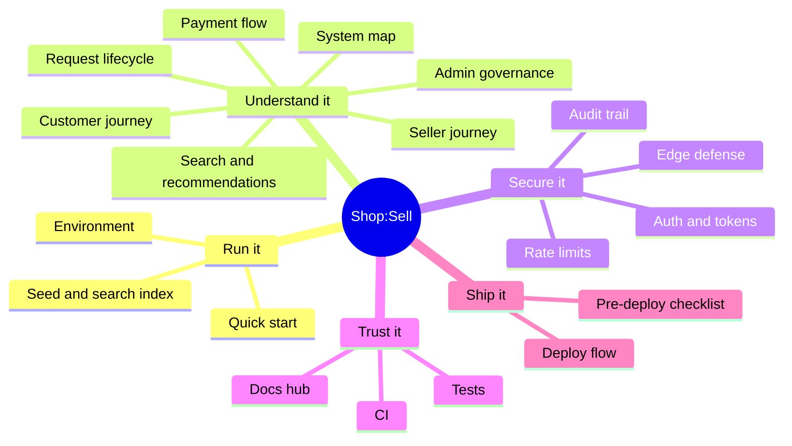

| I want to... | Go to |
|---|---|
| Run the project locally | [🚀 Quick Start](#quick-start) |
| See how all the services connect | [🗺️ System Map](#system-map) |
| Follow one request from browser to database | [🔄 Request Lifecycle](#request-lifecycle) |
| Understand login and tokens | [🔐 Authentication](#authentication) |
| See what protects the edge | [🛡️ Security Map](#security-map) |
| See each role's journey | [🎭 Role Journeys](#role-journeys) |
| Understand payments | [💳 Payment Flow](#payment-flow) |
| Run the tests | [🧪 Testing](#testing) |
| Prepare a deployment | [🌐 Deployment](#deployment) |
| Read deeper docs | [📚 Docs Hub](#docs-hub) |

> **Tip:** GitHub renders the diagrams but does not make nodes inside them clickable. The table above and the ▶ sections below are the interactive part: click an arrow to expand.

---

<a id="quick-start"></a>
## 🚀 Quick Start

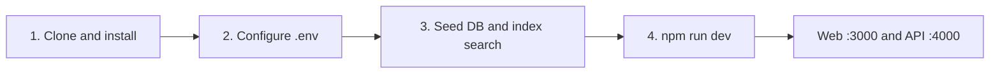

<details open>
<summary><b>1. Clone and install</b></summary>

```bash
git clone https://github.com/jathinreddy-5/Shop-Sell.git
cd Shop-Sell
npm ci        # installs all workspaces: apps/web, apps/api, packages/shared
```
</details>

<details open>
<summary><b>2. Configure environment variables</b></summary>

```bash
cp .env.example .env
# Generate each secret separately, never reuse values between variables or environments:
openssl rand -hex 32
```

<details>
<summary><b>🔍 Environment variable reference (names only)</b></summary>

| Variable | Used by | Notes |
|---|---|---|
| `NODE_ENV` | all | Must be `production` in live deployments |
| `JWT_SECRET` | api, web | Same value in both, at least 32 bytes |
| `SUPABASE_JWT_SECRET` | api | Supabase token signature secret |
| `ADMIN_JWT_SECRET` | api | Admin tokens, must differ from `JWT_SECRET` |
| `INTERNAL_API_SECRET` | api, web | Web-to-API proxy secret, at least 32 bytes, no default |
| `LOG_HASH_KEY` | api, web | HMAC key for hashing identifiers in logs, separate from `JWT_SECRET` |
| `ENABLE_DEMO_ACCOUNTS` | api, web | Local testing only. App refuses to start if `true` in production |
| `UPSTASH_REDIS_REST_URL` / `UPSTASH_REDIS_REST_TOKEN` | api, web | Rate limiting and OTP storage |
| `CLOUDFLARE_TURNSTILE_SECRET_KEY` | web | Server only |
| `NEXT_PUBLIC_TURNSTILE_SITE_KEY` | web | Public by design |
| `SUPABASE_SERVICE_ROLE_KEY` | api | Server only, never a `NEXT_PUBLIC_` variable |
| `RAZORPAY_KEY_SECRET` | api | Server only |

Secrets must be at least 32 bytes and must not be placeholders. The apps fail at startup otherwise.
</details>
</details>

<details open>
<summary><b>3. Seed the database and search index</b></summary>

```bash
npm run seed      # sample sellers, categories, products, pgvector embeddings
npm run reindex   # sync the catalogue into Typesense
```
</details>

<details open>
<summary><b>4. Start the dev servers</b></summary>

```bash
npm run dev
```

- 🌐 Web: http://localhost:3000
- 🔌 API: http://localhost:4000 (rejects calls without the internal proxy secret)
</details>

<p align="right"><a href="#shopsell">⬆ Back to top</a></p>

---

<a id="system-map"></a>
## 🗺️ System Map

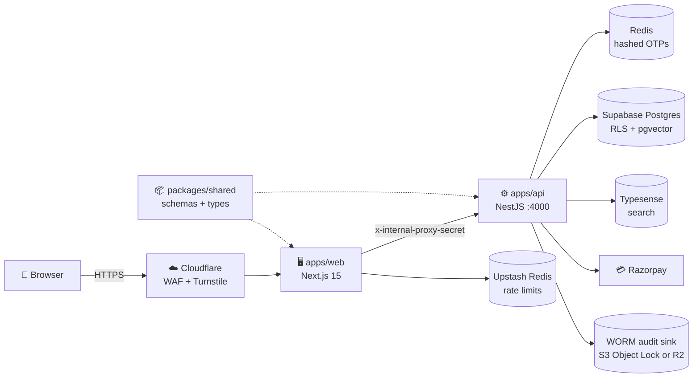

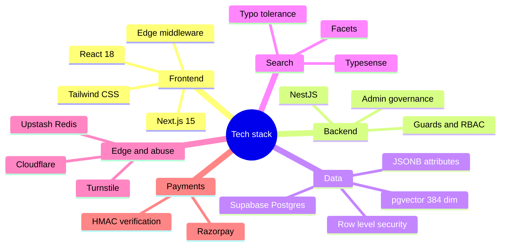

<details>
<summary><b>▶ Repository map</b></summary>

```text
Shop-Sell/
├── apps/
│   ├── web/        Next.js app: storefront, seller portal, auth proxy routes, middleware
│   └── api/        NestJS API: auth, orders, payments, admin governance
├── packages/
│   └── shared/     Zod schemas, types, security validators (server-only entry)
├── scripts/        seed and reindex
├── test/k6/        load tests
├── docs/           cloudflare-setup, security-fixes, architecture, admin specs
└── .github/workflows/ci.yml
```
</details>

<p align="right"><a href="#shopsell">⬆ Back to top</a></p>

---

<a id="request-lifecycle"></a>
## 🔄 Request Lifecycle

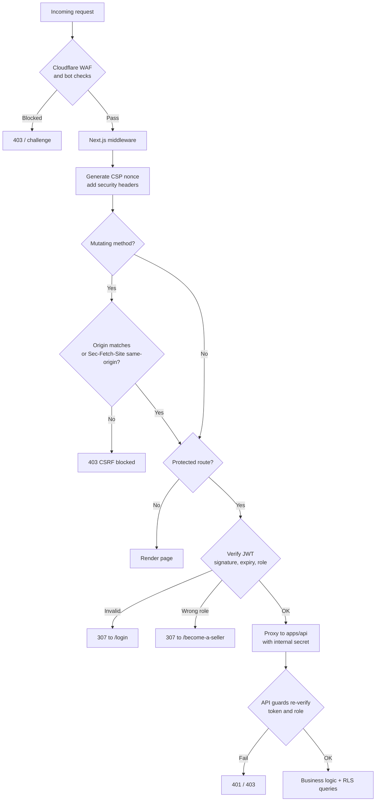

---

<a id="authentication"></a>
## 🔐 Authentication

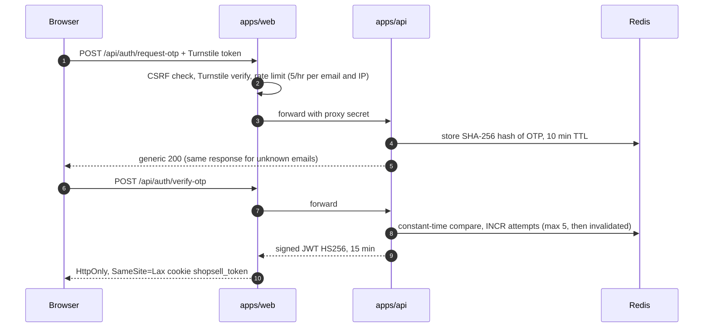

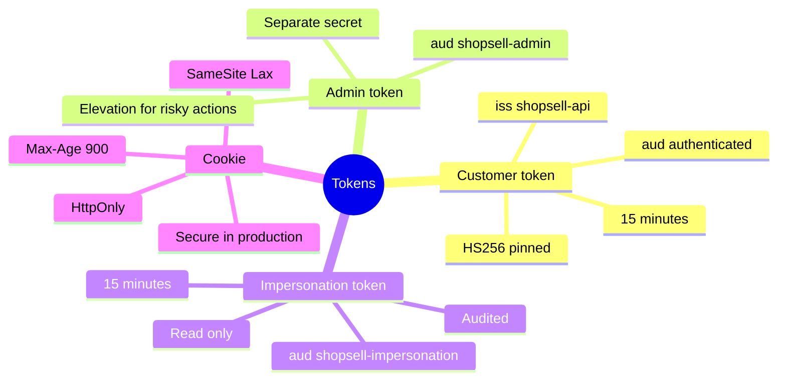

<details>
<summary><b>▶ Route protection table</b></summary>

| Situation | Result |
|---|---|
| No token on a protected page | Redirect to `/login?redirect=...` |
| Customer token on `/seller/*` | Redirect to `/become-a-seller` |
| Tampered `shopsell_roles` cookie | Ignored, only the signed token counts |
| Expired or wrong-signature token | Rejected in middleware, proxy route, and API |
| Direct call to the API without proxy secret | `403` |
| Impersonation token on POST/PUT/PATCH/DELETE | `403`, sessions are read-only |
</details>

<p align="right"><a href="#shopsell">⬆ Back to top</a></p>

---

<a id="security-map"></a>
## 🛡️ Security Map

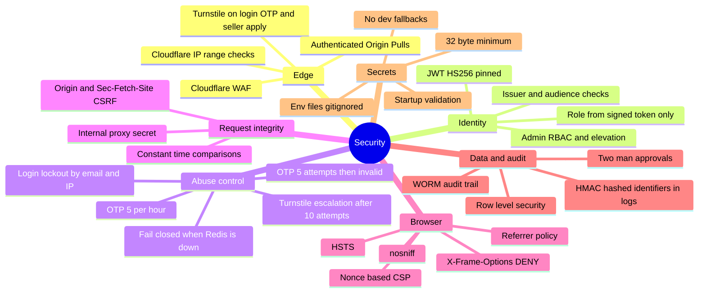

<details>
<summary><b>▶ Edge defense, step by step</b></summary>

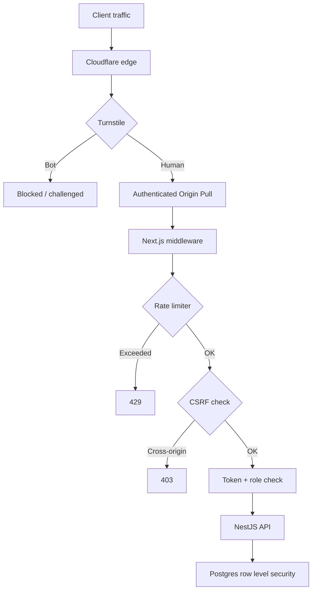

- **Turnstile** protects `/login`, `/api/auth/request-otp`, and `/become-a-seller`.
- **Token checks** use `jose` in the web layer and `jsonwebtoken` in the API, both pinned to HS256.
- **Rate limits** live in a shared Redis store so they hold across instances.
- **Origin protection** means the origin only accepts Cloudflare traffic. See [`docs/cloudflare-setup.md`](docs/cloudflare-setup.md).
</details>

<p align="right"><a href="#shopsell">⬆ Back to top</a></p>

---

<a id="role-journeys"></a>
## 🎭 Role Journeys

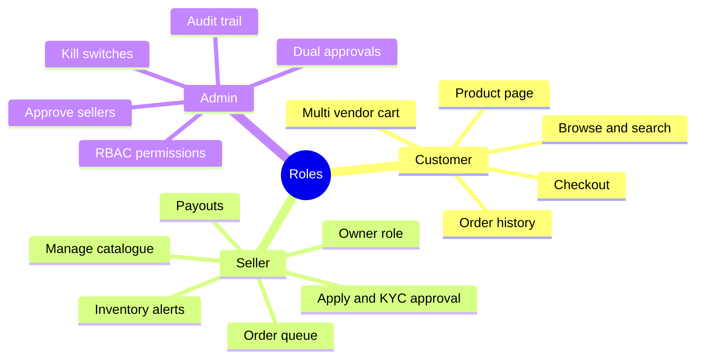

<details>
<summary><b>🛒 Customer: discovery to delivery</b></summary>

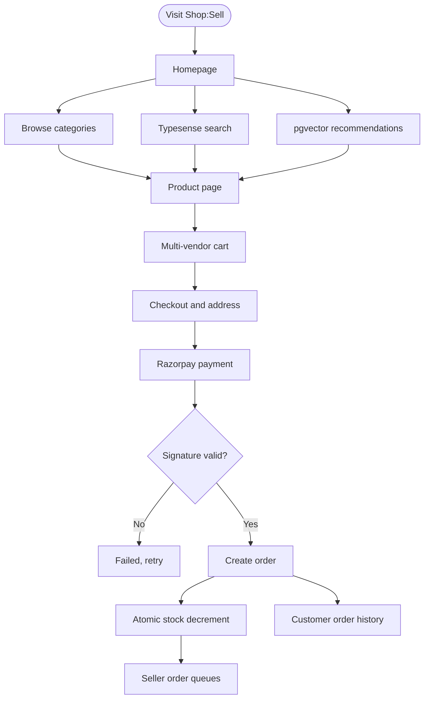
</details>

<details>
<summary><b>🏪 Seller: store, inventory, payouts</b></summary>

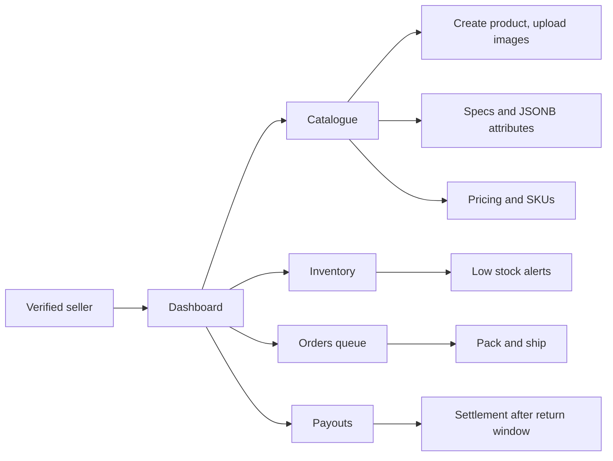

Order status flow: `PENDING` → `CONFIRMED` → `SHIPPED` → `DELIVERED`.
</details>

<details>
<summary><b>👮 Admin: governance, kill switches, audit</b></summary>

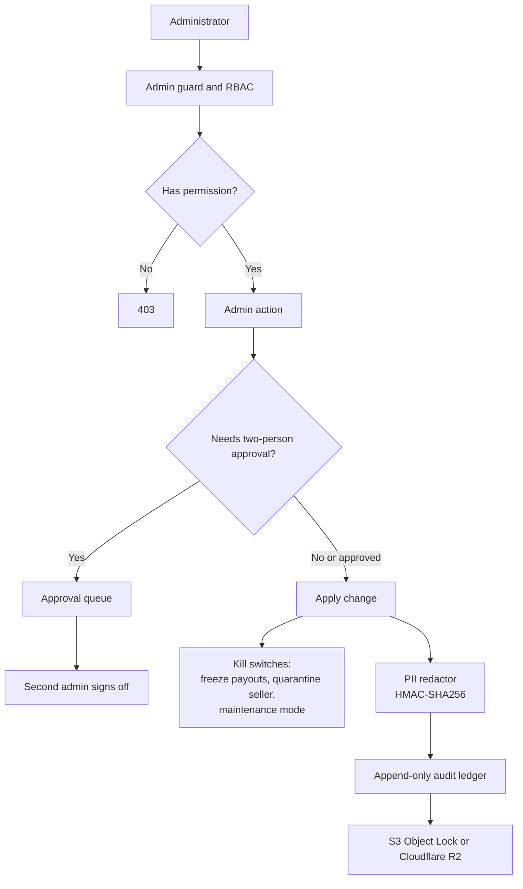

Permissions include `USERS_READ`, `SELLERS_APPROVE`, `FINANCE_PAYOUT`, `SYSTEM_CONFIG`. Full matrix: [`docs/admin/permissions.md`](docs/admin/permissions.md).
</details>

<p align="right"><a href="#shopsell">⬆ Back to top</a></p>

---

<a id="payment-flow"></a>
## 💳 Payment Flow

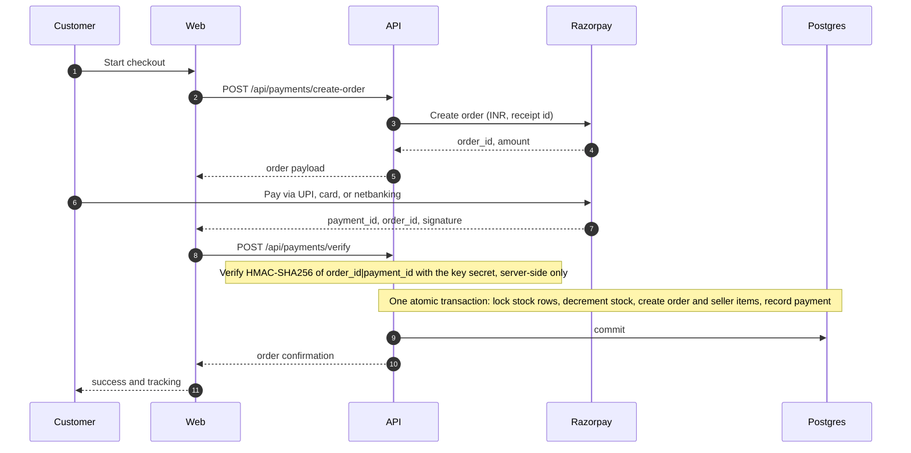

> Never mark an order paid from the client's success message. The server verifies the signature (and should also reconcile with Razorpay webhooks).

---

## 🧠 Search & Recommendations

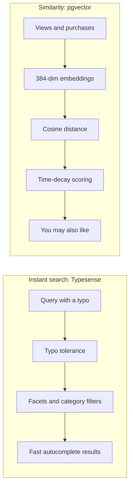

---

<a id="testing"></a>
## 🧪 Testing

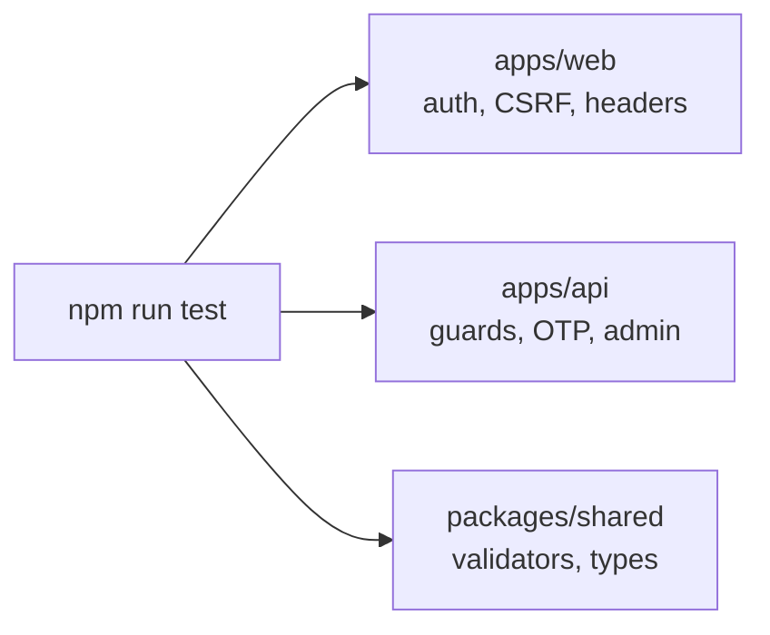

```bash
npm run test                       # everything
npm --prefix apps/web test         # web security and auth tests
npm --prefix apps/api test         # API and admin governance tests
npm --prefix packages/shared test  # shared package tests
k6 run test/k6/load-test.js        # load test against a local API
```

<details>
<summary><b>▶ What the security tests cover</b></summary>

- Tampered role cookie, missing, expired, and wrong-signature tokens
- Cookie flags: HttpOnly, SameSite, Max-Age, Secure in production
- Turnstile failure, CSRF (cross-origin, missing, and `null` Origin), proxy-secret rejection
- OTP expiry, attempt limits, single use
- Login lockout, anti-enumeration
- CSP nonce uniqueness and security headers
- Startup validation of secrets and demo-account flag in production
</details>

Check the [CI status](https://github.com/jathinreddy-5/Shop-Sell/actions) for the current pass/fail state.

<p align="right"><a href="#shopsell">⬆ Back to top</a></p>

---

## 🧩 Feature Matrix

| Feature | Scope | Technology |
|---|---|---|
| Multi-vendor storefront | Customer | Next.js 15, React 18, Tailwind CSS |
| Passwordless email login | Security | OTP, hashed storage, constant-time compare, Redis lockout |
| Typo-tolerant search | Core | Typesense, facets |
| Vector recommendations | Core | pgvector 384-dim, time decay |
| Multi-seller cart and orders | Customer | Atomic transactions, stock locking |
| Razorpay checkout | Payments | Server-side HMAC-SHA256 verification |
| Seller portal | Seller | Dashboard, stock tracking, payout ledger |
| Admin RBAC and governance | Admin | Guards, elevation tokens, dual approvals |
| WORM audit logging | Admin | Append-only sink, S3 Object Lock or R2 |
| Edge defense | Security | Cloudflare, Turnstile, Authenticated Origin Pulls, Upstash rate limits |

---

<a id="deployment"></a>
## 🌐 Deployment

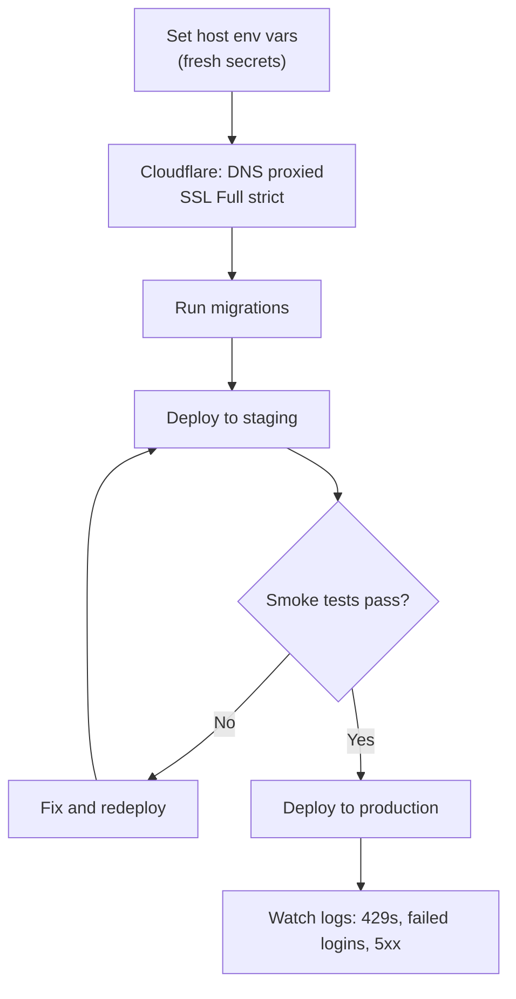

<details>
<summary><b>▶ Pre-deploy checklist</b></summary>

- [ ] CI is green on the branch being deployed
- [ ] `.env` files never committed; git history scanned for secrets
- [ ] Fresh production secrets, none reused from dev
- [ ] `NODE_ENV=production`, `ENABLE_DEMO_ACCOUNTS` unset
- [ ] API reachable only through the web app (proxy secret plus network rules)
- [ ] Production Turnstile keys with the real domain added
- [ ] OTP email sent from a transactional provider with SPF, DKIM, DMARC
- [ ] Database backups enabled and a restore tested
- [ ] Row level security and storage rules reviewed
- [ ] Payments verified server-side, webhooks configured
- [ ] Error monitoring and alerts for failed logins
- [ ] `npm audit --omit=dev` reviewed
</details>

---

<a id="docs-hub"></a>
## 📚 Docs Hub

| Document | Purpose |
|---|---|
| [`docs/cloudflare-setup.md`](docs/cloudflare-setup.md) | Turnstile, WAF rules, Authenticated Origin Pulls |
| [`docs/security-fixes.md`](docs/security-fixes.md) | All security hardening changes and the signer/verifier matrix |
| [`docs/admin-management-and-governance.md`](docs/admin-management-and-governance.md) | Admin RBAC, elevation, kill switches |
| [`docs/architecture.md`](docs/architecture.md) | Scaling topology: PgBouncer, replicas, Redis, CDN |
| [`docs/user-onboarding-specification.md`](docs/user-onboarding-specification.md) | Progressive profiling and onboarding |
| [`docs/admin/permissions.md`](docs/admin/permissions.md) | Admin roles and permission codes |
| [`docs/admin/audit.md`](docs/admin/audit.md) | Audit trail, redaction format, sinks |

---

<div align="center">

**Shop:Sell: Discover. Shop. Sell. Govern.**

[⬆ Back to top](#shopsell)

</div>
