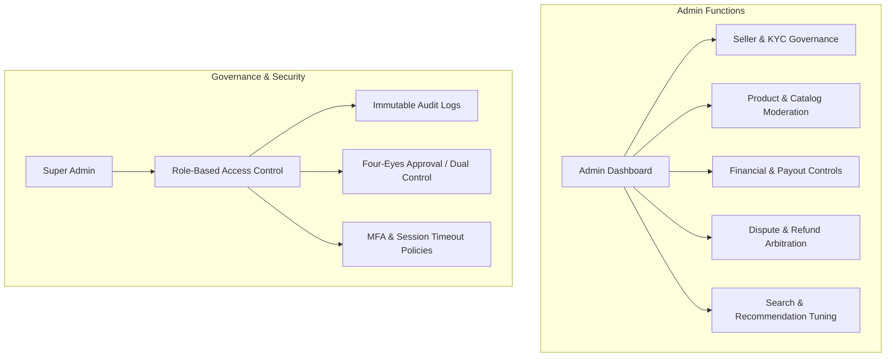

# Admin Capabilities & Platform Management Architecture
**Shop:Sell Multi-Vendor Marketplace Operations Guide**  
*Document Version: 1.0.0 | Status: Production Blueprint*

---

## 1. Executive Overview

In a multi-vendor marketplace, the **Admin** operates as the platform orchestrator, regulatory gatekeeper, and trust custodian between customers, independent sellers, and financial institutions.

This document outlines:
1. **Operational Capabilities:** What platform features and entities an admin can manage.
2. **Administrative Governance:** How administrative privileges, access controls, auditability, and operational safety must be structured.



---

## 2. Part I: What an Admin Can Handle (Core Capabilities)

### 2.1. Seller Onboarding & KYC Verification
Vendors cannot sell until verified. Admins govern the vendor lifecycle:
- **Application Review:** Review merchant applications (`/api/admin/sellers/applications`), legal entity proofs (Proprietorship, Partnership, Private Limited), and business registration numbers (GSTIN / PAN / Corporate ID).
- **Banking & Payout Validation:** Review account holder names against registered legal entity names, verify bank branch IFSC codes, and test automated penny-drop verification for automated payouts.
- **Store Status Transitions:**
  - `pending` ➔ `active` (Store approved, storefront goes public)
  - `active` ➔ `suspended` (Flagged for fraudulent orders, poor fulfillment rate, or high dispute ratio)
  - `rejected` (With rejection reason emailed to the applicant)

---

### 2.2. Catalog & Product Moderation
Ensures quality control, intellectual property protection, and regulatory compliance:
- **Pre-Publication / Post-Publication Moderation:** Inspect listings flagged by automated checks (counterfeit keywords, copyright violations, prohibited items, exaggerated claims).
- **Status Override:** Change status (`active`, `draft`, `archived`) with audit reason.
- **Tax & HSN Code Compliance:** Verify seller-assigned Goods & Services Tax (GST) rates and HSN codes to prevent tax fraud on generated invoices.
- **Category & Attribute Schema Management:** Define global category taxonomies, parent-child inheritance trees, and JSON attribute validation schemas (e.g., sizing, voltage, material) via `/api/admin/categories`.

---

### 2.3. Financial Operations & Escrow Settlement
Admins safeguard platform solvency and prevent payment fraud:
- **Platform Fee / Commission Rate Configuration:** Set marketplace take rates (e.g., 8% commission on electronics, 15% on boutique fashion) at category, store, or product levels.
- **Automated Settlement Batches:** View pending payouts held in escrow (`public.payouts` table) for delivered orders past the return window (e.g., T+7 days post-delivery).
- **Payout Approvals & Execution:** Trigger bank batch transfers via Razorpay Route or Stripe Connect, manage failed payout retries, and hold funds in case of dispute.
- **Refund & Chargeback Governance:** Inspect customer return requests, authorize instant refunds back to original payment methods, and deduct refunded amounts from seller ledger balances.

---

### 2.4. Customer Support & Dispute Arbitration
When customers and sellers cannot resolve a return or delivery conflict:
- **Dispute Escalations:** Review evidence submitted by both buyer and seller (unboxing video proofs, courier delivery receipts, weight slips).
- **Arbitration Decisions:**
  - *Customer Favored:* Issue full/partial refund from escrow.
  - *Seller Favored:* Release withheld funds to seller balance.
  - *Courier Liability Claim:* Initiate logistics provider insurance claim for lost/damaged shipments.
- **Review & Rating Moderation:** Remove abusive, offensive, or competitor-brigaded product reviews while protecting authentic customer feedback.

---

### 2.5. Marketplace Discovery, Search & Recommendations
Admins shape customer engagement and seasonal campaigns:
- **Typesense Search Weights:** Boost specific product attributes (brand, title, curated artisan tags) or apply penalty demotions to low-stock or frequently returned items.
- **Hero & Curated Collections:** Pin promotional banners, featured artisan stores, and seasonal sales directly onto the homepage and category headers.
- **Personalization Engine Oversight:** Monitor `/api/recommendations/home` collaborative filtering models and set fallback rules for cold-start users.

---

## 3. Part II: How Admins Should Be Managed (Security & Governance)

Administrative access introduces severe platform risk. A single compromised admin account could divert funds or compromise sensitive customer data. Therefore, the administration system must follow enterprise-grade governance:

### 3.1. Role-Based Access Control (RBAC) & Least Privilege

Never provide global "god mode" to every administrative staff member. Divide responsibilities into specific functional roles:

| Administrative Role | Permitted Actions | Prohibited Actions |
| :--- | :--- | :--- |
| **Super Admin** | Full platform authority, admin user provisioning, commission configuration, emergency system locks. | None (restricted to company executives/CTO). |
| **Finance Controller** | Review settlement batches, release payouts, process tax reconciliations, inspect gateway ledgers. | Cannot edit product listings or approve seller applications. |
| **Trust & Safety Moderator** | Review seller KYC applications, moderate product listings, inspect flagged reviews. | Cannot release bank payouts or issue financial refunds. |
| **Customer Support Lead** | View order statuses, initiate courier tracking investigations, request refund approvals. | Cannot approve payouts > $500 without Finance dual-authorization. |

---

### 3.2. Dual-Control / Four-Eyes Principle (Approval Workflows)

High-impact actions must require **two independent admin approvals**:
1. **Bulk Payout Release:** An accountant drafts the payout batch; a Finance Lead must review and authorize the batch execution.
2. **Permanent Store Deletion / Ban:** A Trust & Safety moderator flags the store; a Senior Admin confirms the suspension.
3. **Refunds Exceeding High Threshold (e.g., > ₹25,000 / $500):** Requires supervisor confirmation before funds are wired back.

---

### 3.3. Immutable Audit Trails (`public.admin_audit_logs`)

Every single administrative action must be immutably recorded in PostgreSQL. Admins must not have permissions to edit or truncate audit tables:

```sql
CREATE TABLE IF NOT EXISTS public.admin_audit_logs (
  id uuid PRIMARY KEY DEFAULT gen_random_uuid(),
  admin_id uuid NOT NULL REFERENCES auth.users(id),
  action varchar(100) NOT NULL, -- e.g., 'payout_batch_approved', 'store_suspended'
  resource_type varchar(50) NOT NULL, -- 'seller', 'product', 'payout', 'refund'
  resource_id varchar(100) NOT NULL,
  before_state jsonb,
  after_state jsonb,
  ip_address varchar(45) NOT NULL,
  user_agent text,
  metadata jsonb DEFAULT '{}'::jsonb,
  created_at timestamptz NOT NULL DEFAULT now()
);

-- RLS: No one (not even admin) can UPDATE or DELETE audit records
ALTER TABLE public.admin_audit_logs ENABLE ROW LEVEL SECURITY;
CREATE POLICY "Admins can view audit logs"
ON public.admin_audit_logs FOR SELECT
USING (EXISTS (SELECT 1 FROM public.profiles WHERE id = auth.uid() AND 'admin' = ANY(roles)));
```

---

### 3.4. Technical Security Controls for Admin Sessions
1. **Mandatory 2FA / Passkey:** Passwords or SMS OTP alone are prohibited for admin accounts. Require TOTP (Google Authenticator / 1Password) or hardware FIDO2 keys (YubiKey).
2. **Strict Session Invalidation:** Admin sessions expire after **15 minutes of inactivity** and require re-authentication for financial actions (sudo mode).
3. **IP Range Restrictions (CIDR / VPN):** Admin panel access (`/admin`) should be restricted at the Cloudflare / Nginx reverse proxy level to company VPN IPs or Cloudflare Access Zero-Trust tunnels.
4. **Data Redaction (PII Masking):** Admin dashboards should mask customer credit card digits, bank account details (showing only last 4 digits: `•••• 3892`), and customer phone numbers unless explicitly unmasked for live courier coordination.
