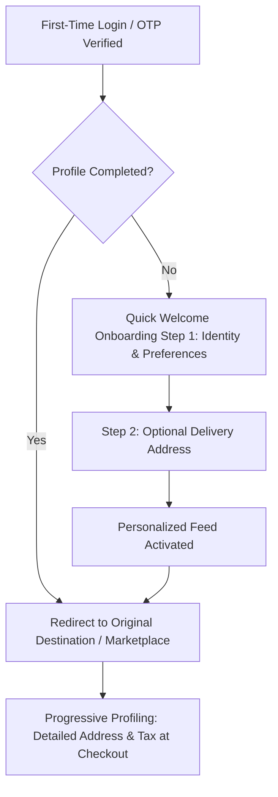

# First-Time User Onboarding Specification (Post-Login Profile Setup)
**Shop:Sell Marketplace Platform Architecture**  
*Document Version: 1.0.0 | Status: Approved Specification*

---

## 1. Executive Summary & Strategy

When users complete their first authentication on **Shop:Sell** (via Email OTP, Mobile SMS OTP, or Google OAuth), they transition from an *authenticated credential* to a *marketplace customer*. 

Demanding too much information upfront causes high bounce rates (drop-off rates exceed 40% when forms exceed 4 required fields). Conversely, collecting zero profile details results in impersonal recommendations, higher checkout abandonment, and delivery failures.

### Recommended Strategy: Progressive Profiling (Two-Tier Model)
1. **Immediate Onboarding (Post-Sign-In Modal/Screen):** Low friction, high personalization value (< 30 seconds to complete).
2. **Contextual / Just-In-Time Profiling (Checkout/Orders):** Exact delivery coordinates, billing addresses, and payment instruments collected when user intent is highest.



---

## 2. Information Architecture (What Should Be Asked)

### Tier 1: Essential Identity & Demographics (Immediate Onboarding)

| Field Name | Type | Requirement | Purpose & Benefit to User |
| :--- | :--- | :--- | :--- |
| **Full Name** | Text (`string`) | **Mandatory** | Required for order communication, invoices, and shipping labels. |
| **Display Name / Handle** | Text (`string`) | *Optional* | Public handle for verified customer reviews, Q&As, and community boards. Defaults to First Name. |
| **Mobile Number** | Phone (`+91 E.164`) | **Mandatory** *(if Email Auth)* | Delivery courier SMS/WhatsApp tracking alerts and OTP confirmation for high-value orders. |
| **Email Address** | Email (`string`) | **Mandatory** *(if Phone Auth)* | PDF tax invoice delivery, order confirmations, and account recovery. |
| **Gender / Honorific** | Select (`enum`) | *Optional* | Sizing recommendations, relevant apparel filtering, and polite correspondence (Mr/Ms/Mx). |
| **Date of Birth** | Date (`YYYY-MM-DD`) | *Optional* | Birthday discounts/coupons, age-restricted category gating (e.g., barware/knives). |

> **Gender Options Specification:**
> - `Female`
> - `Male`
> - `Non-Binary / Third Gender`
> - `Prefer not to say` *(Default selection to respect user privacy)*

---

### Tier 2: Shopping Preferences & Personalization (Zero-Party Data)

Asking 2–3 lightweight interest questions delivers immediate value by tailoring the Typesense search engine and NestJS recommendation models (`/api/recommendations/home`):

| Preference Category | Selection Mode | Example Options | System Action |
| :--- | :--- | :--- | :--- |
| **Top Interests** | Multi-select chips (max 4) | *Electronics, Handmade Crafts, Men's Fashion, Women's Fashion, Home & Living, Organic Foods* | Boosts matching category weights in Redis user event graph. |
| **Apparel / Size Profile** *(Optional)* | Single-select pills | *XS, S, M, L, XL, XXL, Footwear UK sizes* | Pre-filters product variant dropdowns on catalog pages. |
| **Notification Channels** | Toggle switches | • WhatsApp Order Updates (Recommended)<br>• SMS Courier Dispatch<br>• Promotional Email Newsletter | Writes notification preferences to `public.profiles.notification_settings`. |

---

### Tier 3: Delivery Address (Progressive / Optional at Signup, Required at Checkout)

Asking for a full street address immediately after signup causes drop-offs on mobile devices. However, capturing the **Delivery Pincode / Postal Code** upfront unlocks accurate shipping timelines (e.g., *"Delivery in 2 days to 560001"*).

#### Address Structure Specification:
```json
{
  "address_type": "home | work | other",
  "full_name": "Jathin Reddy",
  "phone": "+91 9876543210",
  "alternate_phone": "+91 9812345678",
  "street_address_line1": "Flat 402, Skyline Residency, 12th Main Road",
  "street_address_line2": "Near BDA Complex, Sector 4",
  "landmark": "Opposite Green Valley Supermarket",
  "city": "Bengaluru",
  "state": "Karnataka",
  "postal_code": "560034",
  "country": "IN",
  "is_default_shipping": true,
  "is_default_billing": true,
  "delivery_instructions": "Leave with security guard if unavailable"
}
```

---

## 3. Recommended Multi-Step Onboarding Flow

```
┌────────────────────────────────────────────────────────┐
│ Step 1 of 2: Let's set up your profile                 │
├────────────────────────────────────────────────────────┤
│ Full Name*           [ Jathin Reddy                  ] │
│ Email Address        [ jathin@example.com            ] │
│ Phone Number*        [ +91 | 98765 43210             ] │
│ Gender (Optional)    ( ) Female ( ) Male (•) Non-Binary│
│                      ( ) Prefer not to say             │
│                                                        │
│ [ Continue -> ]                       [ Skip for now ] │
└────────────────────────────────────────────────────────┘
```
```
┌────────────────────────────────────────────────────────┐
│ Step 2 of 2: Personalize your feed (Optional)          │
├────────────────────────────────────────────────────────┤
│ Pick 3 or more categories you love:                    │
│ [✓ Artisanal Crafts] [✓ Smart Gadgets] [ Sustainable ] │
│ [ Home Decor ]       [ Specialty Teas] [ Menswear ]    │
│                                                        │
│ Delivery Pincode:    [ 560034                        ] │
│ (Helps show items available for fast local delivery)   │
│                                                        │
│ [ Complete Setup -> ]                 [ Explore Store ]│
└────────────────────────────────────────────────────────┘
```

---

## 4. Database Schema Integration (PostgreSQL / Supabase)

To support this onboarding data cleanly without slowing down authentication, extend `public.profiles` and add a dedicated `public.addresses` table:

```sql
-- 1. Extend public.profiles
ALTER TABLE public.profiles
ADD COLUMN IF NOT EXISTS gender text CHECK (gender IN ('female', 'male', 'non_binary', 'prefer_not_to_say')),
ADD COLUMN IF NOT EXISTS date_of_birth date,
ADD COLUMN IF NOT EXISTS default_pincode varchar(10),
ADD COLUMN IF NOT EXISTS category_interests text[] DEFAULT '{}',
ADD COLUMN IF NOT EXISTS onboarding_completed boolean DEFAULT false,
ADD COLUMN IF NOT EXISTS notification_preferences jsonb DEFAULT '{"whatsapp": true, "sms": true, "email": true}'::jsonb;

-- 2. Ensure public.addresses supports multiple addresses per customer
CREATE TABLE IF NOT EXISTS public.addresses (
  id uuid PRIMARY KEY DEFAULT gen_random_uuid(),
  user_id uuid NOT NULL REFERENCES auth.users(id) ON DELETE CASCADE,
  address_type varchar(20) NOT NULL DEFAULT 'home', -- 'home', 'work', 'other'
  full_name varchar(255) NOT NULL,
  phone varchar(30) NOT NULL,
  street_address_line1 text NOT NULL,
  street_address_line2 text,
  landmark text,
  city varchar(100) NOT NULL,
  state varchar(100) NOT NULL,
  postal_code varchar(20) NOT NULL,
  country varchar(10) NOT NULL DEFAULT 'IN',
  is_default_shipping boolean NOT NULL DEFAULT false,
  is_default_billing boolean NOT NULL DEFAULT false,
  created_at timestamptz NOT NULL DEFAULT now(),
  updated_at timestamptz NOT NULL DEFAULT now()
);

-- RLS: Customers can only manage their own addresses
ALTER TABLE public.addresses ENABLE ROW LEVEL SECURITY;
CREATE POLICY "Users can manage own addresses"
ON public.addresses FOR ALL
USING (auth.uid() = user_id);
```

---

## 5. Compliance & Privacy Safeguards (DPDP Act & GDPR)
1. **Purpose Limitation:** State explicitly on the form why gender, phone, or address is collected (e.g., *"Used exclusively for delivery coordination and personalized sizing"*).
2. **Never Make Gender Mandatory:** Mandatory demographic disclosure violates privacy standards and induces abandonments.
3. **Pincode Before Street Address:** Storing pincode alone allows delivery date estimates without storing sensitive geo-coordinates.
4. **Instant Skip Button:** Users can click "Skip for now" to browse products immediately; the platform can nudge them to complete their address before placing their first order.
